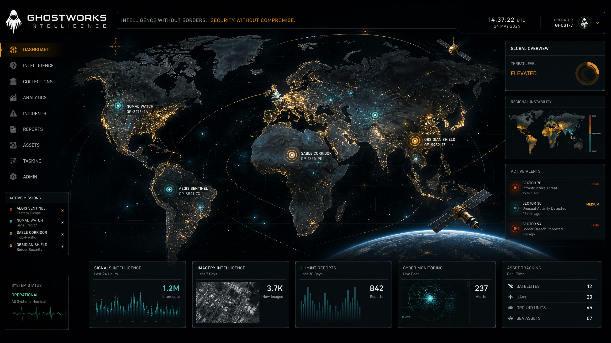
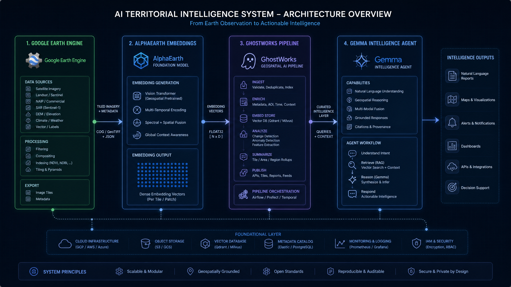
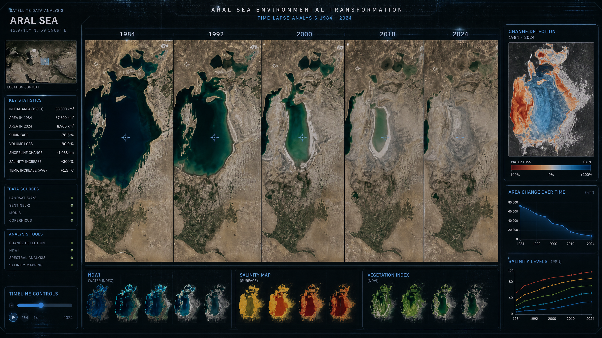
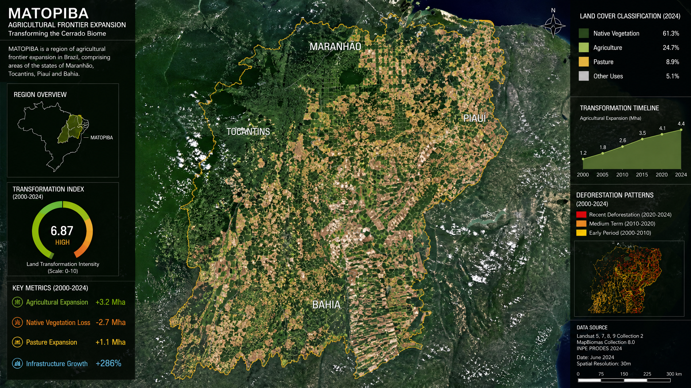

# GhostWorks Intelligence

**AI-powered territorial transformation detection and intelligence generation using satellite foundation models.**



## Overview

GhostWorks Intelligence is a territorial analysis architecture designed to detect, interpret, and contextualize large-scale land transformation events from satellite-derived embeddings.

The system combines:
- **AlphaEarth semantic embeddings** (Google DeepMind)
- **Territorial Transformation Index (TTI)**
- **Multi-sensor anomaly detection**
- **Structured contextual serialization**
- **Gemma-powered territorial intelligence agents**

The goal is not only detecting change, but generating interpretable territorial intelligence reports for environmental monitoring, risk analysis, and policy support.

---

## Core Concept

GhostWorks operates on the **Territorial Transformation Index (TTI)**:

`TTI(x, t₁, t₂) = 1 − cosine_similarity(E(x,t₁), E(x,t₂))`

Where:
- **E** = AlphaEarth embedding
- 64-dimensional semantic representation
- Derived from Sentinel-2 + SAR annual composites

TTI is label-agnostic: the system detects transformation regardless of category.

---

## Architecture



```text
Google Earth Engine
        ↓
AlphaEarth Embeddings
        ↓
GhostWorks Pipeline
        ↓
Structured Outputs (trajectory, outliers, clusters, similar regions)
        ↓
Contextual Serializer
        ↓
Gemma Territorial Intelligence Agent
        ↓
Territorial Intelligence Report
```

---

## Included Components

### `ghostworks_serializer.py`
Transforms GhostWorks pipeline outputs into structured JSON contextual representations optimized for Gemma-based territorial analysis.
- Temporal trajectory summarization
- Anomaly synthesis
- Clustering interpretation
- Similar region contextualization
- Automatic session serialization

### `ghostworks_gemma_prompt.py`
System prompt and orchestration layer for the GhostWorks Intelligence Agent.
- Evidence-constrained territorial reasoning
- Structured intelligence reporting
- Transformation hypothesis generation
- Risk projection workflows

### `ghostworks_intelligence_demo.ipynb`
End-to-end demo notebook:
- Loads GhostWorks outputs
- Serializes territorial sessions
- Builds contextual prompts
- Generates territorial intelligence reports

---

## Case Studies

### Aral Sea

- Accelerating TTI trajectory
- Hydrological collapse
- Salinization dynamics
- Desertification signatures

### MATOPIBA

- Agricultural frontier expansion
- Cerrado transformation
- Agribusiness pressure
- Live territorial restructuring

---

## Technical Stack
- Google Earth Engine
- AlphaEarth Foundation Model
- Python / Google Colab
- Vertex AI
- Gemma-family models

## Research Foundation
- **TTI Brazil 2017–2024**
- ACM CHI 2026 workshop papers
- LuxVerso Research Initiative
- Zenodo: [TTI Brazil 2017–2024 Zenodo Record](https://zenodo.org/records/19654985)

## Author
**Vinicius Buri**
LuxVerso Research Initiative
Salvador, Bahia, Brazil
ORCID: 0009-0000-6006-1516

## License
CC-BY 4.0
